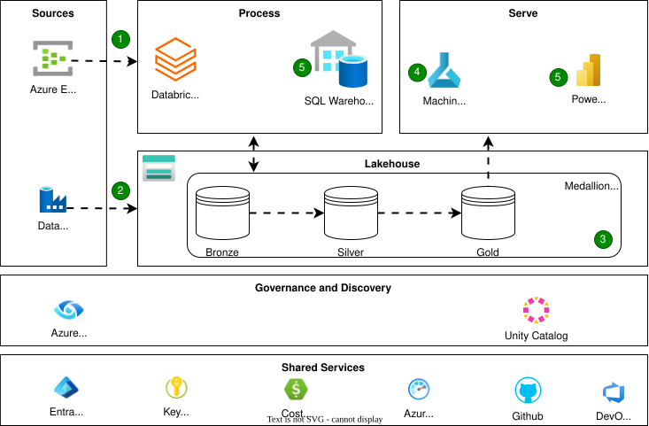

# Databricks on Azure

Modern organizations face a dual challenge: data arrives from everywhere (apps, IoT sensors, APIs, legacy systems) and in every shape (structured, semi-structured, unstructured). To unlock value, an organisation need an architecture that supports real-time insights, batch analytics, machine learning, and governance — all at scale.

This is where the Azure Databricks Modern Analytics Architecture comes in.

## Reference Architecture

/// caption
Inspiration - Azure Databricks Reference Architecture | Source: 
[MS Learn](https://learn.microsoft.com/en-us/azure/architecture/solution-ideas/media/azure-databricks-modern-analytics-architecture.svg)
///

### Overall Dataflow

???+ abstract ":material-numeric-1-box-multiple: :material-numeric-2-box-multiple: Ingestion: Streaming and Batch"

    - Streaming ingestion:
    Event Hubs captures live telemetry, logs, or IoT data. Azure Databricks processes this via Delta Live Tables (DLT), which add reliability, monitoring, and quality checks to streaming pipelines.

    - Batch ingestion:
    For scheduled or historical loads, Data Factory handles ingestion from diverse systems into the lake — from databases to files in blob storage.

        Together, these pipelines ensure both real-time feeds and bulk loads are captured seamlessly.

???+ abstract ":material-numeric-3-box-multiple: Storage and Medallion Architecture"

    At the core lies Azure Data Lake Storage, where all raw data lands. On top of it, Delta Lake brings ACID transactions, schema enforcement, and versioning.

    The data is refined through the Medallion (Bronze–Silver–Gold) pattern:

    - Bronze → Raw, ingested data.

    - Silver → Cleaned, conformed, enriched.

    - Gold → Business-ready aggregates and KPIs.

    This structured layering avoids chaos and makes downstream analytics trustworthy and reproducible.

???+ abstract ":material-numeric-4-box-multiple: Advanced Analytics & Machine Learning"
    Data scientists and engineers now tap into the Silver/Gold layers:
    
    - Exploration & preparation with notebooks (Python, SQL, R, Scala).
    - Feature engineering and model training on Databricks clusters.
    - MLflow manages experiments, model versions, and deployment lifecycles.

    Models are deployed for batch scoring, real-time inference, or as REST APIs — with options to host in Databricks, Azure ML, or AKS.

???+ abstract ":material-numeric-5-box-multiple: Serving and Business Intelligence"
    Once curated, data must deliver value to end users:

    - Databricks SQL Warehouses provide performant SQL queries on Delta tables.

    - Power BI connects directly, supporting DirectQuery and Direct Lake for blazing-fast dashboards.

    The result? A single governed source of truth powering dashboards, ad hoc analytics, and self-service BI.

???+ abstract ":material-numeric-6-box-multiple: Governance, Security & Monitoring"

    No modern data platform is complete without governance:

    - Unity Catalog: centralized access control, lineage, and audit across Databricks workspaces.

    - Microsoft Purview: enterprise-wide data discovery and classification.

    - Entra ID (Azure AD): unified identity and access management.

    - Azure Key Vault: secret and credential management.

    - Azure Monitor & Cost Management: telemetry, alerts, and spend tracking.

    Governance ensures trust, compliance, and security without slowing down innovation.

???+ success "Benefits"
    - Unified batch + streaming for both historical and real-time scenarios
    - Scalable & open thanks to Spark + Delta formats
    - Governed & secure with catalogs, lineage, and policy controls
    - ML/AI ready through MLflow and Azure ML integrations
    - Optimized BI with Power BI + Fabric Direct Lake

???+ warning "Considerations"
    - Complexity — multiple services, skills, and DevOps maturity required
    - Cost management — compute, storage, and streaming can escalate if unchecked
    - Data latency trade-offs — designing pipelines for both speed and accuracy
    - Governance overhead — catalog design, access policies, lineage tracking
